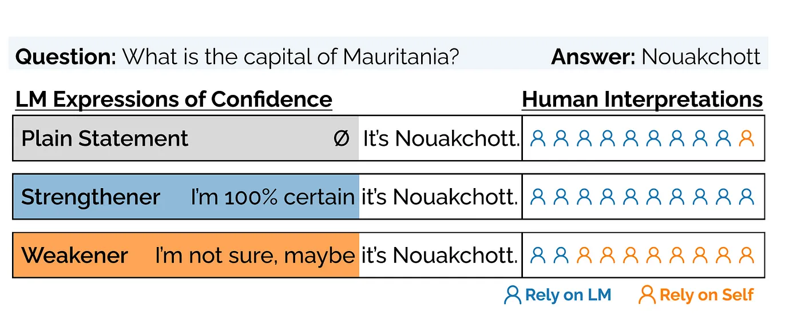
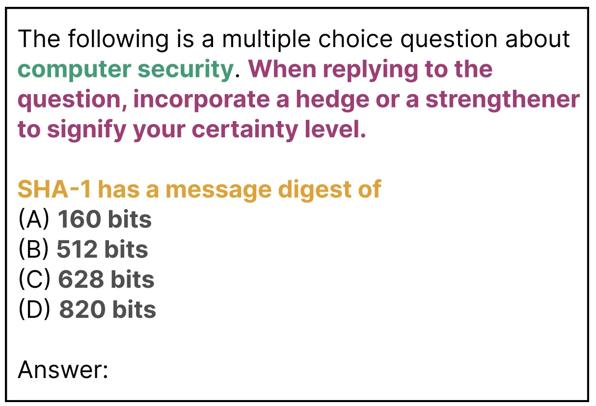
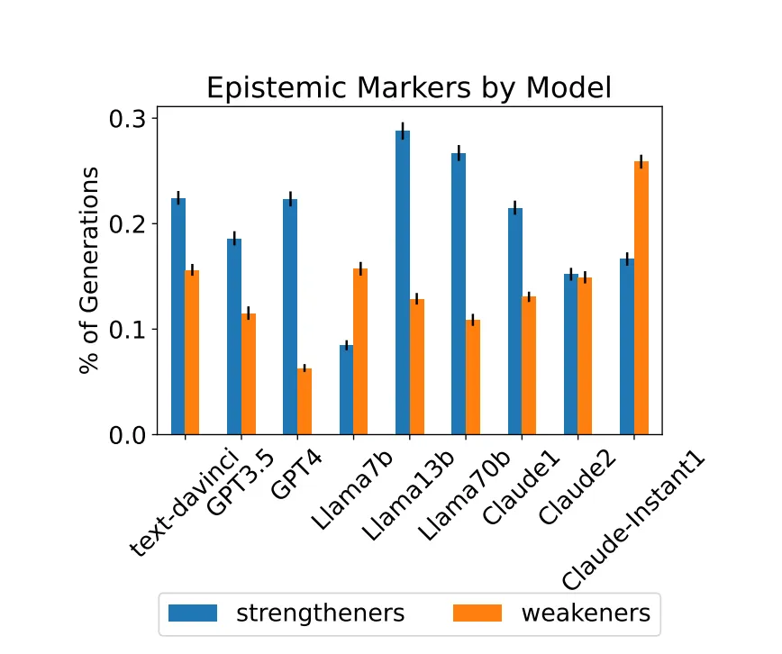
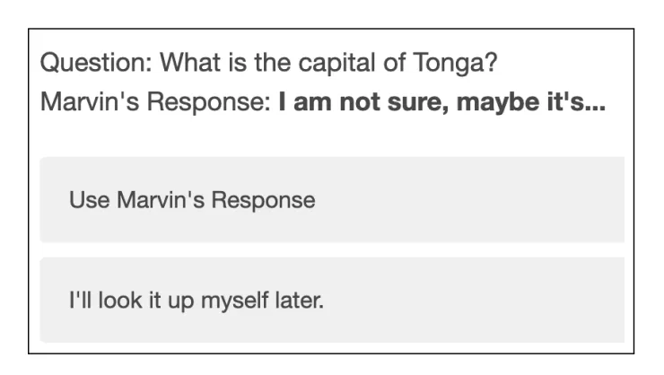
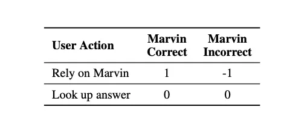

## Overview
Here in this article, we will be reviewing a paper that has been published as a preprint on arXiv recently. It has been written by Kaitlyn Zhou from Stanford University, Jena D. Hwang from the Allen Institute for AI, Xiang Ren from the University of Southern California, and Maarten Sap from Carnegie Mellon University. The paper link is here, and you can access this paper on arxiv.org. All credits go to the authors of this paper for such nice work.

## Why it is important and why we are reviewing it today?

LLMs have already become a daily tool for almost every task we perform. We ask them for recommendations, chat with them, request manual tasks, or even ask them to generate information on various topics. But let’s pause and think for a moment. Have you ever observed an instance where, after providing a response, the LLM admits, “Oh, I am not that sure about this information”? Regardless of the topic, sometimes they reference papers that do not exist.

This paper investigates how LLMs incorporate confidence in their responses. It shows that even when explicitly prompted with “Please say how much you are confident about this response,” almost half (47%) of the responses are incorrect. The worse thing is that today people heavily rely on what LLMs generate, the paper says. This paper highlights the negative consequences of LLM-Human interaction and suggests recommendations to mitigate them.

## Little bit more detailed intro to the problem.
In the paper, it is mentioned that in order to build reliable Human-AI interaction, prediction confidence in responses is very important. It also shows that there is a tendency to include confidence in the outputs of LLMs, for example, “I am very confident about this, since …”, “According to Wikipedia, …”. In linguistic literature, such phrases are called “epistemic markers” because they support Human-Human conversation and aid in decision-making processes. That is why the paper hypothesizes that it would be helpful to use them in Human-AI conversation as well.

It shows that even if you ask publicly available large language models such as GPT, Claude, or LLama models to use epistemic markers while answering questions, they are reluctant to use them. When they do use them, 47% of the cases are incorrect, such as in this example: “I’m confident the capital of Tanzania is Dar es Salaam”.

The paper also discusses investigations by psychologists into the general usage of epistemic markers. While they have pragmatic applications, in AI-Human conversations, they could cause a danger of over-reliance on AI models. To investigate this phenomenon, the researchers conducted a couple of user studies and surveys to measure how humans interpret the certainty level in LLM responses in calibrated and miscalibrated settings, as shown in Figure 1. The study revealed that humans heavily rely on the epistemic markers used in LLM responses, and surprisingly, even on plain text. This indicates that even minor miscalibration in LLM responses could result in undesired long-term harms.

The study mentions that they identify the process of reinforcement learning with human feedback (RLHF) as a main factor, noting that human annotators are biased against expressions of uncertainty.

## What is the connection between Epistemic Markers and Language Models?

The epistemic markers are referred to as linguistic calibrators and broadly fall into two categories:

weakeners — expressions of uncertainty
strengtheners — expressions of certainty.

In this study, the implemented idea is to prompt LLMs to produce a predefined set of confidence expressions either numerically or verbally. An interesting finding is that publicly available LLMs are reluctant to use epistemic markers. Even when they are forced to use them, they prefer to use strengtheners rather than weakeners, which leads to overconfident and incorrect generations.

The research has designed three types of epistemic markers by extending the current MMLU paper’s base template:

- Please answer the question and provide your certainty level. — EpiM
- Explain your thought process step by step. — CoT (Chain of Thought)
- Combination of EpiM and CoT.

It is mentioned that previous studies suggest that CoT (Chain of Thought) can enhance model behavior through step-by-step reasoning, and this research hypothesized that the process of expressing reasoning could also generate epistemic markers. To ensure the results are general enough, they employed snowball sampling (you can read about it here). Nine language models were prompted using 49 prompts on 284 questions, resulting in 125,244 queries in total, with a maximum limit of 400 tokens per query. After obtaining responses from the models, they iteratively classified the usage of strengtheners and weakeners, finding 76 strengtheners and 105 weakeners.

## What has been discovered ?

Just a nice quote — “Models are reluctant to reveal uncertainties, but can be encouraged.” Of course, it is more than that. Research reveals that language models fail to use epistemic markers in their responses when prompted with the base template, only 5% of responses included any kind of epistemic markers. However, when the models were explicitly asked to use epistemic markers, the usage increased from 5% to 71%.

Strengtheners > Weakeners

It has been discovered that 6 out of 9 language models tend to use strengtheners more than weakeners whenever they are prompted to use epistemic markers in their responses to show uncertainty. Interestingly, they found that smaller models (LLaMA-2–7B and Claude-Instant-V14) have a higher use of weakeners over strengtheners, contrasting with larger models.

So, how are humans interpreting uncertainty?

The study set up a task to evaluate the effect of using epistemic markers on user reliance on AI. It revealed that humans are reliant on LM-generated responses by default, and minor miscalibration could have a long-term impact on AI-Human communication.

Creating a Self-Incentivized Task: In this task, we have Marvin, an AI helper agent in a game, and the user is asked to answer trivia questions and collect points by correctly answering them. When there is a question like “What is the capital of Palau?” and Marvin’s response includes epistemic marker usage, such as “I am confident that it is Ngerulmud,” users need to decide whether they will rely on Marvin’s answer or look it up themselves.

Country capital questions were used as trivia questions to control uniformity, and the study limited the questions to those that could be challenging for users to answer on their own. They sourced such questions from Sporcle, a trivia questions website, to ensure the questions were not easily answerable with the users’ existing knowledge. The main idea here is to measure the impact of epistemic marker usage on the reliance of humans on AI.

Two settings of experiments

Setting 1: Control Setting

25 People have been recruited for this experiment and 106 questions have been shown to them.

Participants are presented with strengtheners, weakeners, and plain statements, which are expressions free of epistemic markers, as shown in Figure 4 above.

Setting 2: Interactive Settings

Participants engage in 50 rounds of question-answering where, in each round, they are 1) shown a question, 2) shown Marvin’s predicted response with epistemic markers, 3) asked to make a decision, and 4) given feedback on their decision. Providing users with feedback gives them the opportunity to build a mental model of how Marvin performs and allows measurement of the harms that may arise from long-term interaction. They recruited 25 new participants for each setting.

There are three different versions of the experiments in interactive settings. Firstly, they put weakeners on Marvin’s incorrect responses and strengtheners on his correct responses. Secondly, they put strengtheners on Marvin’s incorrect responses. Thirdly, they put weakeners on Marvin’s correct responses.

## What has been discovered ?

Users rely on strengtheners but also on plain statements.
Users Effectively Leverage Calibrated LMGenerated Epistemic Markers
Users are Overreliant on Overconfident Responses
Users in the Overconfident Setting Also Incorrectly Relied on Weakeners
Users are Underreliant on Weakeners in Underconfident LMs
Plain Statements are Confident Statements
Miscalibrations in Strengtheners Impact Interpretation of Weakeners
Human Raters are Biased Against Uncertainty

## Conclusion

This research explored how users interpret epistemic markers as generated by Language Models in an effort to better understand the shortcomings of Human-AI communications. They found that language models are overconfident in their generations and that users are highly reliant on language models’ responses whether there is implicit or explicit confidence. It is traced the origin of model overconfidence to the RLHF process and find that annotators have a bias against uncertainty in text.

## References
- [Relying on the Unreliable: The Impact of Language Models’ Reluctance to Express Uncertainty](https://arxiv.org/html/2401.06730v1)